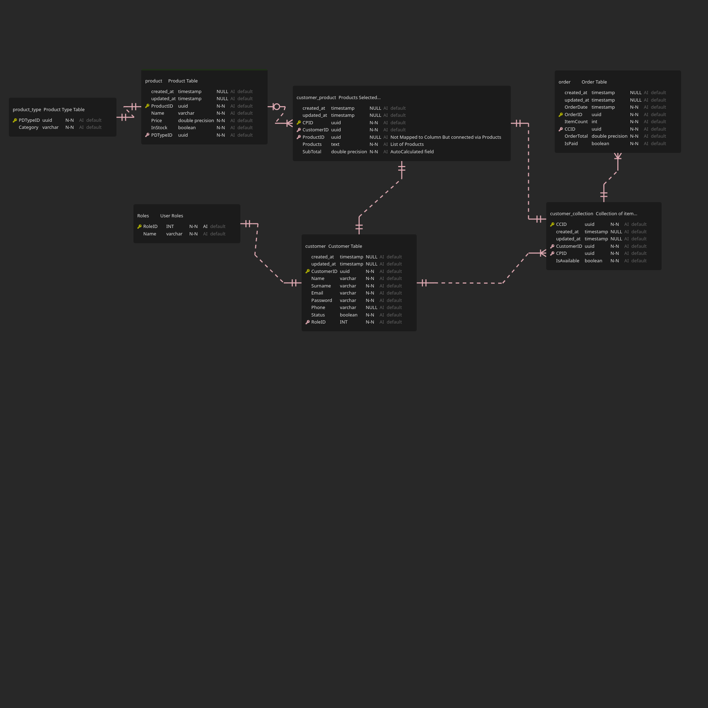

# .NET CORE 7.0 AND PostgresSQL 15

## BEGIN HERE:

**For in-depth information regarding this concept discussed here will be available soon.** 

Take a look at the **ERD OR SQL** templates in the ERD folder and check how initially the database was structured.



**QUESTION**: Was the database translated to the RestAPI as in the templates? Find the answer in the actual endpoints.

**Technologies used**: 

    1. .NET Core 7.0
    2. PostgresSQL 15
    3. EntityFrameworkCore

### INSTRUCTIONS

    1. Make sure postgres is running and able to connect.
    2. Run terminal in directory : /backend then:
        ```
        dotnet restore
        ```

### INFORMATION

To access all endpoints, register as Admin or Customer.

Authentication and Authorization is setup.

All **endpoints** information is found at

```
    https://localhost:5001/swagger
```

**Docker and web caching** is not setup for this series but files are available.

More concepts will be introduced soon.

**Good Luck Navigating !!!**

